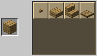

# WoodCutter

A Minecraft datapack to use the stone cutter as a wood cutter.

## Minecraft recipe update
WodCutter update default minecraft recipes for stairs and trapdoor.

> **6 planks gives 6 stairs instead of 4**
>
> 

> **1 plank give 1 trapdoor instead of 6 planks for 2 trapdoor**
>
> 

## New crafts
 WoodCutter also create new recipe to convert back to log, planks, stairs and trapdoor..

> **6 planks give 1 log**
>
> 

> **2 slabs give 1 plank**
>
> 

> **1 trapdoor give 1 plank**
>
> 

> **2 stairs give 1 slab**
>
> 

> **2 slabs give 1 stair**
>
> 

> **2 slabs give 1 trapdoor**
>
> 

## Wood cutter

Finally, the stone cutter can be used as a wood cutter

> 

> 

## Installation
Visit the [minecraft wiki](https://minecraft.fandom.com/wiki/Tutorials/Installing_a_data_pack) to know how to install a data pack.

